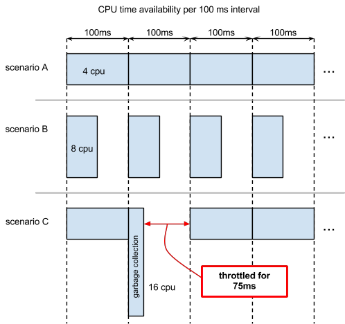

Resources Isolation and Sizing
==============================

- [Isolation](#isolation)
- [Sizing](#sizing)
- [Oversubscription](#oversubscription)

Isolation
---------

Aurora is a multi-tenant system; a single software instance runs on a
server, serving multiple clients/tenants. To share resources among
tenants, it implements isolation of:

* CPU
* memory
* disk space

CPU is a soft limit, and handled differently from memory and disk space.
Too low a CPU value results in throttling your application and
slowing it down. Memory and disk space are both hard limits; when your
application goes over these values, it's killed.

### CPU Isolation

Mesos uses a quota based CPU scheduler (the *Completely Fair Scheduler*)
to provide consistent and predictable performance.  This is effectively
a guarantee of resources -- you receive at least what you requested, but
also no more than you've requested.

The scheduler gives applications a CPU quota for every 100 ms interval.
When an application uses its quota for an interval, it is throttled for
the rest of the 100 ms. Usage resets for each interval and unused
quota does not carry over.

For example, an application specifying 4.0 CPU has access to 400 ms of
CPU time every 100 ms. This CPU quota can be used in different ways,
depending on the application and available resources. Consider the
scenarios shown in this diagram.

* *Scenario A*: the application can use up to 4 cores continuously for
every 100 ms interval. It is never throttled and starts processing
new requests immediately.

* *Scenario B* : the application uses up to 8 cores (depending on
availability) but is throttled after 50 ms. The CPU quota resets at the
start of each new 100 ms interval.

* *Scenario C* : is like Scenario A, but there is a garbage collection
event in the second interval that consumes all CPU quota. The
application throttles for the remaining 75 ms of that interval and
cannot service requests until the next interval. In this example, the
garbage collection finished in one interval but, depending on how much
garbage needs collecting, it may take more than one interval and further
delay service of requests.

*Technical Note*: Mesos considers logical cores, also known as
hyperthreading or SMT cores, as the unit of CPU.

### Memory Isolation

Mesos uses dedicated memory allocation. Your application always has
access to the amount of memory specified in your configuration. The
application's memory use is defined as the sum of the resident set size
(RSS) of all processes in a shard. Each shard is considered
independently.

In other words, say you specified a memory size of 10GB. Each shard
would receive 10GB of memory. If an individual shard's memory demands
exceed 10GB, that shard is killed, but the other shards continue
working.

*Technical note*: Total memory size is not enforced at allocation time,
so your application can request more than its allocation without getting
an ENOMEM. However, it will be killed shortly after.

### Disk Space

Disk space used by your application is defined as the sum of the files'
disk space in your application's directory, including the `stdout` and
`stderr` logged from your application. Each shard is considered
independently. You should use off-node storage for your application's
data whenever possible.

In other words, say you specified disk space size of 100MB. Each shard
would receive 100MB of disk space. If an individual shard's disk space
demands exceed 100MB, that shard is killed, but the other shards
continue working.

After your application finishes running, its allocated disk space is
reclaimed. Thus, your job's final action should move any disk content
that you want to keep, such as logs, to your home file system or other
less transitory storage. Disk reclamation takes place an undefined
period after the application finish time; until then, the disk contents
are still available but you shouldn't count on them being so.

*Technical note* : Disk space is not enforced at write so your
application can write above its quota without getting an ENOSPC, but it
will be killed shortly after. This is subject to change.

### Other Resources

Other resources, such as network bandwidth, do not have any performance
guarantees. For some resources, such as memory bandwidth, there are no
practical sharing methods so some application combinations collocated on
the same host may cause contention.

Sizing
-------

### CPU Sizing

To correctly size Aurora-run Mesos tasks, specify a per-shard CPU value
that lets the task run at its desired performance when at peak load
distributed across all shards. Include reserve capacity of at least 50%,
possibly more, depending on how critical your service is (or how
confident you are about your original estimate : -)), ideally by
increasing the number of shards to also improve resiliency. When running
your application, observe its CPU stats over time. If consistently at or
near your quota during peak load, you should consider increasing either
per-shard CPU or the number of shards.

## Memory Sizing

Size for your application's peak requirement. Observe the per-instance
memory statistics over time, as memory requirements can vary over
different periods. Remember that if your application exceeds its memory
value, it will be killed, so you should also add a safety margin of
around 10-20%. If you have the ability to do so, you may also want to
put alerts on the per-instance memory.

## Disk Space Sizing

Size for your application's peak requirement. Rotate and discard log
files as needed to stay within your quota. When running a Java process,
add the maximum size of the Java heap to your disk space requirement, in
order to account for an out of memory error dumping the heap
into the application's sandbox space.

Oversubscription
----------------

**WARNING**: This feature is currently in alpha status. Do not use it in production clusters!

Mesos [supports a concept of revocable tasks](http://mesos.apache.org/documentation/latest/oversubscription/)
by oversubscribing machine resources by the amount deemed safe to not affect the existing
non-revocable tasks. Aurora now supports revocable jobs via a `tier` setting set to `revocable`
value.

The Aurora scheduler must be configured to receive revocable offers from Mesos and accept revocable
jobs. If not configured properly revocable tasks will never get assigned to hosts and will stay in
`PENDING`. Set these scheduler flag to allow receiving revocable Mesos offers:

    -receive_revocable_resources=true

Specify a tier configuration file path (unless you want to use the [default](../../src/main/resources/org/apache/aurora/scheduler/tiers.json)):

    -tier_config=path/to/tiers/config.json

See the [Configuration Reference](../references/configuration.md) for details on how to mark a job
as being revocable.
