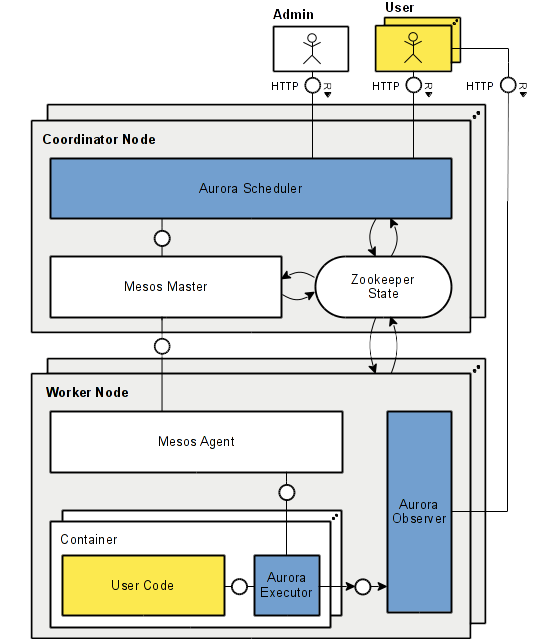

# Installing Aurora

- [Components](#components)
    - [Machine profiles](#machine-profiles)
      - [Coordinator](#coordinator)
      - [Worker](#worker)
      - [Client](#client)
- [Getting Aurora](#getting-aurora)
    - [Building your own binary packages](#building-your-own-binary-packages)
    - [RPMs](#rpms)
- [Installing the scheduler](#installing-the-scheduler)
    - [Ubuntu Trusty](#ubuntu-trusty)
    - [CentOS 7](#centos-7)
    - [Finalizing](#finalizing)
    - [Configuration](#configuration)
- [Installing worker components](#installing-worker-components)
    - [Ubuntu Trusty](#ubuntu-trusty-1)
    - [CentOS 7](#centos-7-1)
    - [Configuration](#configuration-1)
- [Installing the client](#installing-the-client)
    - [Ubuntu Trusty](#ubuntu-trusty-2)
    - [CentOS 7](#centos-7-2)
    - [Configuration](#configuration-2)
- [See also](#see-also)
- [Installing Mesos](#installing-mesos)
    - [Mesos on Ubuntu Trusty](#mesos-on-ubuntu-trusty)
    - [Mesos on CentOS 7](#mesos-on-centos-7)

## Components
Before installing Aurora, it's important to have an understanding of the components that make up
a functioning Aurora cluster.

* **Aurora scheduler**  
  The scheduler will be your primary interface to the work you run in your cluster.  You will
  instruct it to run jobs, and it will manage them in Mesos for you.  You will also frequently use
  the scheduler's web interface as a heads-up display for what's running in your cluster.

* **Aurora client**  
  The client (`aurora` command) is a command line tool that exposes primitives that you can use to
  interact with the scheduler.

  Aurora also provides an admin client (`aurora_admin` command) that contains commands built for
  cluster administrators.  You can use this tool to do things like manage user quotas and manage
  graceful maintenance on machines in cluster.

* **Aurora executor**  
  The executor (a.k.a. Thermos executor) is responsible for carrying out the workloads described in
  the Aurora DSL (`.aurora` files).  The executor is what actually executes user processes.  It will
  also perform health checking of tasks and register tasks in ZooKeeper for the purposes of dynamic
  service discovery.  You can find lots more detail on the executor and Thermos in the
  [user guide](user-guide.md).

* **Aurora observer**  
  The observer provides browser-based access to the status of individual tasks executing on worker
  machines.  It gives insight into the processes executing, and facilitates browsing of task sandbox
  directories.

* **ZooKeeper**  
  [ZooKeeper](http://zookeeper.apache.org) is a distributed consensus system.  In an Aurora cluster
  it is used for reliable election of the leading Aurora scheduler and Mesos master.

* **Mesos master**  
  The master is responsible for tracking worker machines and performing accounting of their
  resources.  The scheduler interfaces with the master to control the cluster.

* **Mesos agent**  
  The agent receives work assigned by the scheduler and executes them.  It interfaces with Linux
  isolation systems like cgroups, namespaces and Docker to manage the resource consumption of tasks.
  When a user task is launched, the agent will launch the executor (in the context of a Linux cgroup
  or Docker container depending upon the environment), which will in turn fork user processes.

## Machine profiles
Given that many of these components communicate over the network, there are numerous ways you could
assemble them to create an Aurora cluster.  The simplest way is to think in terms of three machine
profiles:

### Coordinator
**Components**: ZooKeeper, Aurora scheduler, Mesos master

A small number of machines (typically 3 or 5) responsible for cluster orchestration.  In most cases
it is fine to co-locate these components in anything but very large clusters (> 1000 machines).
Beyond that point, operators will likely want to manage these services on separate machines.

In practice, 5 coordinators have been shown to reliably manage clusters with tens of thousands of
machines.

### Worker
**Components**: Aurora executor, Aurora observer, Mesos agent

The bulk of the cluster, where services will actually run.

### Client
**Components**: Aurora client, Aurora admin client

Any machines that users submit jobs from.

## Getting Aurora
Source and binary distributions can be found on our
[downloads](https://aurora.apache.org/downloads/) page.  Installing from binary packages is
recommended for most.

### Building your own binary packages
Our package build toolchain makes it easy to build your own packages if you would like.  See the
[instructions](https://github.com/apache/aurora-packaging) to learn how.

### RPMs
We currently have work in progress to provide official RPMs.  As of this writing, the suggested way
to get RPMs is to [build them](#building-your-own-binary-packages).

We do have unofficial experimental RPMs available for testing purposes.

**Use these RPMs at your own risk, they are not officially released under the ASF guidelines.**

    echo '[apache-aurora-wfarner]
    name=Apache Aurora distribution maintained by wfarner
    baseurl=http://people.apache.org/~wfarner/aurora/distributions/0.9.0/rpm/centos-7/x86_64/
    gpgcheck = 0' | sudo tee /etc/yum.repos.d/apache-aurora-wfarner.repo > /dev/null

## Installing the scheduler
### Ubuntu Trusty

1. Install Mesos  
   Skip down to [install mesos](#mesos-on-ubuntu-trusty), then run:

        sudo start mesos-master

2. Install ZooKeeper

        sudo apt-get install -y zookeeperd

3. Install the Aurora scheduler

        wget -c https://apache.bintray.com/aurora/aurora-scheduler_0.10.0-1_amd64.deb
        sudo dpkg -i aurora-scheduler_0.10.0-1_amd64.deb

### CentOS 7

1. Install Mesos  
   Skip down to [install mesos](#mesos-on-centos-7), then run:

        sudo systemctl start mesos-master

2. Install ZooKeeper

        sudo rpm -Uvh https://archive.cloudera.com/cdh4/one-click-install/redhat/6/x86_64/cloudera-cdh-4-0.x86_64.rpm
        sudo yum install -y java-1.8.0-openjdk-headless zookeeper-server

        sudo service zookeeper-server init
        sudo systemctl start zookeeper-server

3. Install the Aurora scheduler  
   If you haven't already, read the section on [how to get Aurora RPMs](#rpms).

        # Note: for older Aurora RPM versions, this may be called 'aurora'.
        sudo yum install -y aurora-scheduler

Note: if you are using the unreleased 0.9.0 RPM, you will need to edit `/etc/sysconfig/aurora`:  
Change  
`-mesos_master_address='zk://127.0.0.1:2181/mesos/master'`  
To  
`-mesos_master_address='zk://127.0.0.1:2181/mesos'`  
And  
`-native_log_file_path='/var/lib/aurora/db'`  
To  
`-native_log_file_path='/var/lib/aurora/scheduler/db'`

### Finalizing
By default, the scheduler will start in an uninitialized mode.  This is because external
coordination is necessary to be certain operator error does not result in a quorum of schedulers
starting up and believing their databases are empty when in fact they should be re-joining a
cluster.

Because of this, a fresh install of the scheduler will need intervention to start up.  First,
stop the scheduler service.  
Ubuntu: `sudo stop aurora-scheduler`  
CentOS: `sudo systemctl stop aurora`

Now initialize the database:

    sudo -u aurora mkdir -p /var/lib/aurora/scheduler/db
    sudo -u aurora mesos-log initialize --path=/var/lib/aurora/scheduler/db

Now you can start the scheduler back up.  
Ubuntu: `sudo start aurora-scheduler`  
CentOS: `sudo systemctl start aurora`

### Configuration
For more detail on this topic, see the dedicated page on
[deploying the scheduler](deploying-aurora-scheduler.md)

## Installing worker components
### Ubuntu Trusty

1. Install Mesos  
   Skip down to [install mesos](#mesos-on-ubuntu-trusty), then run:

        sudo start mesos-slave

2. Install Aurora executor and observer

        wget -c https://apache.bintray.com/aurora/aurora-executor_0.10.0-1_amd64.deb
        sudo dpkg -i aurora-executor_0.10.0-1_amd64.deb

### CentOS 7

1. Install Mesos  
   Skip down to [install mesos](#mesos-on-centos-7), then run:

        sudo systemctl start mesos-slave

2. Install Aurora executor and observer  
   If you haven't already, read the section on [how to get Aurora RPMs](#rpms).

        # Note: for older Aurora RPM versions, this may be called 'aurora-thermos'.
        sudo yum install -y aurora-executor

### Configuration
The executor and observer typically do not require much configuration.  Command line arguments can
be passed to the executor using a command line argument on the scheduler.

## Installing the client
### Ubuntu Trusty

    sudo apt-get install -y python2.7 wget

    wget https://apache.bintray.com/aurora/aurora-tools_0.10.0-1_amd64.deb
    sudo dpkg -i aurora-tools_0.10.0-1_amd64.deb

### CentOS 7
If you haven't already, read the section on [how to get Aurora RPMs](#rpms).

    # Note: for older Aurora RPM versions, this may be called 'aurora-client'.
    sudo yum install -y aurora-tools

### Configuration
Client configuration lives in a json file that describes the clusters available and how to reach
them.  By default this file is at `/etc/aurora/clusters.json`.

Jobs may be submitted to the scheduler using the client, and are described with
[job configurations](configuration-reference.md) expressed in `.aurora` files.  Typically you will
maintain a single job configuration file to describe one or more deployment environments (e.g.
dev, test, prod) for a production job.

## See also
We have other docs that you will find useful once you have your cluster up and running:

- [Monitor](monitoring.md) your cluster
- Enable scheduler [security](security.md)
- View job SLA [statistics](sla.md)
- Understand the internals of the scheduler's [storage](storage.md)

## Installing Mesos
Mesos uses a single package for the Mesos master and slave.  As a result, the package dependencies
are identical for both.

### Mesos on Ubuntu Trusty

    sudo add-apt-repository ppa:openjdk-r/ppa -y
    sudo apt-get update

    sudo apt-get install -y software-properties-common wget libsvn1 libcurl3 openjdk-8-jre-headless

    wget -c http://downloads.mesosphere.io/master/ubuntu/14.04/mesos_0.23.0-1.0.ubuntu1404_amd64.deb
    sudo dpkg -i mesos_0.23.0-1.0.ubuntu1404_amd64.deb

### Mesos on CentOS 7

    sudo rpm -Uvh http://repos.mesosphere.io/el/7/noarch/RPMS/mesosphere-el-repo-7-1.noarch.rpm
    sudo yum install -y mesos-0.22.0
