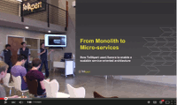
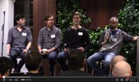
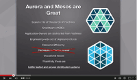
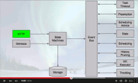
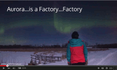

# Apache Aurora Presentations
Video and slides from presentations and panel discussions about Apache Aurora.

_(Listed in date descending order)_

<table>
	<tr>
		<td></td>
		<td><strong><a href="https://www.youtube.com/watch?v=yXkOgnyK4Hw">From Monolith to Microservices w/ Aurora (Video)</a></strong>
		
Presented by Thanos Baskous, Tony Dong, Dobromir Montauk

		
April 30, 2015 at <a href="http://www.meetup.com/Bay-Area-Apache-Aurora-Users-Group/events/221219480/">Bay Area Apache Aurora Users Group</a>
</td>
	</tr>
	<tr>
		<td></td>
		<td><strong><a href="http://www.slideshare.net/zembutsu/apache-aurora-introduction-and-tutorial-osc15tk">Apache Auroraの始めかた (Slides)</a></strong>
		
Presented by Masahito Zembutsu

		
February 28, 2015 at <a href="http://www.ospn.jp/osc2015-spring/">Open Source Conference 2015 Tokyo Spring</a>
</td>
	</tr>
	<tr>
		<td></td>
		<td><strong><a href="https://www.youtube.com/watch?v=2Jsj0zFdRlg">Apache Aurora Adopters Panel (Video)</a></strong>
		
Panelists Ben Staffin, Josh Adams, Bill Farner, Berk Demir

		
February 19, 2015 at <a href="http://www.meetup.com/Bay-Area-Mesos-User-Group/events/220279080/">Bay Area Mesos Users Group</a>
</td>
	</tr>
	<tr>
		<td></td>
		<td><strong><a href="https://www.youtube.com/watch?v=E4lxX6epM_U">Operating Apache Aurora and Mesos at Twitter (Video)</a></strong>
		
Presented by Joe Smith

		
February 19, 2015 at <a href="http://www.meetup.com/Bay-Area-Mesos-User-Group/events/220279080/">Bay Area Mesos Users Group</a>
</td>
	</tr>
	<tr>
		<td></td>
		<td><strong><a href="https://www.youtube.com/watch?v=ZZXtXLvTXAE">Apache Aurora and Mesos at TellApart (Video)</a></strong>
		
Presented by Steve Niemitz

		
February 19, 2015 at <a href="http://www.meetup.com/Bay-Area-Mesos-User-Group/events/220279080/">Bay Area Mesos Users Group</a>
</td>
	</tr>
	<tr>
		<td></td>
		<td><strong><a href="https://www.youtube.com/watch?v=Dsc5CPhKs4o">Past, Present, and Future of the Aurora Scheduler (Video)</a></strong>
		
Presented by Bill Farner

		
August 21, 2014 at <a href="http://events.linuxfoundation.org/events/archive/2014/mesoscon">#MesosCon 2014</a>

</td>
	</tr>
	<tr>
		<td></td>
		<td><strong><a href="https://www.youtube.com/watch?v=asd_h6VzaJc">Introduction to Apache Aurora (Video)</a></strong>
		
Presented by Bill Farner

		
March 25, 2014 at <a href="https://www.eventbrite.com/e/aurora-and-mesosframeworksmeetup-tickets-10850994617">Aurora and Mesos Frameworks Meetup</a>
</td>
	</tr>
</table>