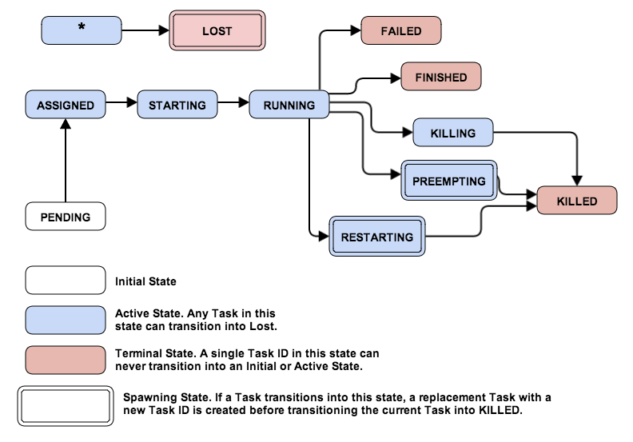

# Task Lifecycle

When Aurora reads a configuration file and finds a `Job` definition, it:

1.  Evaluates the `Job` definition.
2.  Splits the `Job` into its constituent `Task`s.
3.  Sends those `Task`s to the scheduler.
4.  The scheduler puts the `Task`s into `PENDING` state, starting each
    `Task`'s life cycle.

Please note, a couple of task states described below are missing from
this state diagram.

## PENDING to RUNNING states

When a `Task` is in the `PENDING` state, the scheduler constantly
searches for machines satisfying that `Task`'s resource request
requirements (RAM, disk space, CPU time) while maintaining configuration
constraints such as "a `Task` must run on machines  dedicated  to a
particular role" or attribute limit constraints such as "at most 2
`Task`s from the same `Job` may run on each rack". When the scheduler
finds a suitable match, it assigns the `Task` to a machine and puts the
`Task` into the `ASSIGNED` state.

From the `ASSIGNED` state, the scheduler sends an RPC to the agent
machine containing `Task` configuration, which the agent uses to spawn
an executor responsible for the `Task`'s lifecycle. When the scheduler
receives an acknowledgment that the machine has accepted the `Task`,
the `Task` goes into `STARTING` state.

`STARTING` state initializes a `Task` sandbox. When the sandbox is fully
initialized, Thermos begins to invoke `Process`es. Also, the agent
machine sends an update to the scheduler that the `Task` is
in `RUNNING` state, only after the task satisfies the liveness requirements.
See [Health Checking](../features/services#health-checking) for more details
for how to configure health checks.

## RUNNING to terminal states

There are various ways that an active `Task` can transition into a terminal
state. By definition, it can never leave this state. However, depending on
nature of the termination and the originating `Job` definition
(e.g. `service`, `max_task_failures`), a replacement `Task` might be
scheduled.

### Natural Termination: FINISHED, FAILED

A `RUNNING` `Task` can terminate without direct user interaction. For
example, it may be a finite computation that finishes, even something as
simple as `echo hello world.`, or it could be an exceptional condition in
a long-lived service. If the `Task` is successful (its underlying
processes have succeeded with exit status `0` or finished without
reaching failure limits) it moves into `FINISHED` state. If it finished
after reaching a set of failure limits, it goes into `FAILED` state.

A terminated `TASK` which is subject to rescheduling will be temporarily
`THROTTLED`, if it is considered to be flapping. A task is flapping, if its
previous invocation was terminated after less than 5 minutes (scheduler
default). The time penalty a task has to remain in the `THROTTLED` state,
before it is eligible for rescheduling, increases with each consecutive
failure.

### Forceful Termination: KILLING, RESTARTING

You can terminate a `Task` by issuing an `aurora job kill` command, which
moves it into `KILLING` state. The scheduler then sends the agent a
request to terminate the `Task`. If the scheduler receives a successful
response, it moves the Task into `KILLED` state and never restarts it.

If a `Task` is forced into the `RESTARTING` state via the `aurora job restart`
command, the scheduler kills the underlying task but in parallel schedules
an identical replacement for it.

In any case, the responsible executor on the agent follows an escalation
sequence when killing a running task:

  1. If a `HttpLifecycleConfig` is not present, skip to (4).
  2. Send a POST to the `graceful_shutdown_endpoint` and wait
  `graceful_shutdown_wait_secs` seconds.
  3. Send a POST to the `shutdown_endpoint` and wait
  `shutdown_wait_secs` seconds.
  4. Send SIGTERM (`kill`) and wait at most `finalization_wait` seconds.
  5. Send SIGKILL (`kill -9`).

If the executor notices that all `Process`es in a `Task` have aborted
during this sequence, it will not proceed with subsequent steps.
Note that graceful shutdown is best-effort, and due to the many
inevitable realities of distributed systems, it may not be performed.

### Unexpected Termination: LOST

If a `Task` stays in a transient task state for too long (such as `ASSIGNED`
or `STARTING`), the scheduler forces it into `LOST` state, creating a new
`Task` in its place that's sent into `PENDING` state.

In addition, if the Mesos core tells the scheduler that a agent has
become unhealthy (or outright disappeared), the `Task`s assigned to that
agent go into `LOST` state and new `Task`s are created in their place.
From `PENDING` state, there is no guarantee a `Task` will be reassigned
to the same machine unless job constraints explicitly force it there.

## RUNNING to PARTITIONED states
If Aurora is configured to enable partition awareness, a task which is in a
running state can transition to `PARTITIONED`. This happens when the state
of the task in Mesos becomes unknown. By default Aurora errs on the side of
availability, so all tasks that transition to `PARTITIONED` are immediately
transitioned to `LOST`.

This policy is not ideal for all types of workloads you may wish to run in
your Aurora cluster, e.g. for jobs where task failures are very expensive.
So job owners may set their own `PartitionPolicy` where they can control
how long to remain in `PARTITIONED` before transitioning to `LOST`. Or they
can disable any automatic attempts to `reschedule` when in `PARTITIONED`,
effectively waiting out the partition for as long as possible.

## PARTITIONED and transient states
The `PartitionPolicy` provided by users only applies to tasks which are
currently running. When tasks are moving in and out of transient states,
e.g. tasks being updated, restarted, preempted, etc., `PARTITIONED` tasks
are moved immediately to `LOST`. This prevents situations where system
or user-initiated actions are blocked indefinitely waiting for partitions
to resolve (that may never be resolved).

### Giving Priority to Production Tasks: PREEMPTING

Sometimes a Task needs to be interrupted, such as when a non-production
Task's resources are needed by a higher priority production Task. This
type of interruption is called a *pre-emption*. When this happens in
Aurora, the non-production Task is killed and moved into
the `PREEMPTING` state  when both the following are true:

- The task being killed is a non-production task.
- The other task is a `PENDING` production task that hasn't been
  scheduled due to a lack of resources.

The scheduler UI shows the non-production task was preempted in favor of
the production task. At some point, tasks in `PREEMPTING` move to `KILLED`.

Note that non-production tasks consuming many resources are likely to be
preempted in favor of production tasks.

### Making Room for Maintenance: DRAINING

Cluster operators can set agent into maintenance mode. This will transition
all `Task` running on this agent into `DRAINING` and eventually to `KILLED`.
Drained `Task`s will be restarted on other agents for which no maintenance
has been announced yet.

## State Reconciliation

Due to the many inevitable realities of distributed systems, there might
be a mismatch of perceived and actual cluster state (e.g. a machine returns
from a `netsplit` but the scheduler has already marked all its `Task`s as
`LOST` and rescheduled them).

Aurora regularly runs a state reconciliation process in order to detect
and correct such issues (e.g. by killing the errant `RUNNING` tasks).
By default, the proper detection of all failure scenarios and inconsistencies
may take up to an hour.

To emphasize this point: there is no uniqueness guarantee for a single
instance of a job in the presence of network partitions. If the `Task`
requires that, it should be baked in at the application level using a
distributed coordination service such as Zookeeper.
